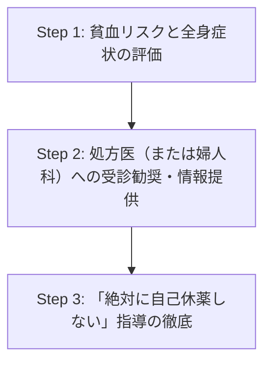

# 🩸 月経量が増えたら？薬剤師が確認したい薬剤とは

  <strong>【服薬指導での気づきエピソード】</strong> 
  ある日、心房細動で抗凝固薬（DOAC）を新規服用し始めて3ヶ月経つ40代の女性患者さんが来局されました。「お薬を飲み始めてから調子はどうですか？」とお声掛けすると、少し言いにくそうに<strong>「体調は悪くないんですが、最近生理の量が急に増えて、夜用ナプキンでも追いつかない日があって……これってお薬のせいでしょうか？」</strong>と相談を受けました。  
  一瞬「出血傾向だな」と頭をよぎったものの、DOACによる月経への影響度や、どのような質問でアセスメントすべきか、処方医へどうフィードバックすべきか、即座に明確な引き出しが出てこず、冷や汗をかいた経験があります。

女性患者さんにとって「デリケートな悩み」である月経。実は、私たちが日常的に調剤している特定の薬剤によって<strong>月経量が増加（過多月経）</strong>することがあります。

今回は、薬剤師が実務で絶対に押さえておきたい<strong>「月経量 増加 薬剤」の関係性</strong>と、<strong>薬剤性過多月経に対する服薬指導</strong>のアプローチについて徹底解説します！

---

## 🔍 1. 「過多月経」の定義と患者の訴えをキャッチする方法

そもそも、医学的な「過多月経」とはどのような状態を指すのでしょうか。

  📌 過多月経の定義 
  正常な1周期の総月経血量は<strong>20〜140mL</strong>とされています。これを超えて<strong>140mL以上</strong>になる場合を過多月経と呼びます。

しかし、患者さんが「自分の月経血量が何ミリリットルか」を測定することは不可能です。そのため、実務では以下のような<strong>主観的・客観的目安</strong>を患者さんから聞き取る必要があります。

### 💬 患者アセスメントのための質問フレーズ例
- <strong>「日中でも夜用の大きなナプキンを頻繁に（1〜2時間おきに）変えなければいけない状況ですか？」</strong>
- <strong>「レバーのような大きな血の塊（2〜3cm以上）が混ざることはありませんか？」</strong>
- <strong>「生理の時期に、普段と違う息切れや立ちくらみ、強いだるさを感じませんか？」</strong>（貧血の有無の確認）

---

## 💊 2. 月経量を増加させる（薬剤性過多月経を引き起こす）代表的な薬剤

患者さんから「月経量が増えた」と相談された際、まず確認すべき主要な薬剤クラスを紹介します。

  

    
① 抗凝固薬・抗血小板薬

    

      DOAC（特にリバーロキサバン等）やワーファリン、バイアスピリンなど。止血機構を阻害するため、直接的に月経量を増加させます。
    

  

  

    
② 抗腫瘍薬（ホルモン療法薬）

    

      タモキシフェン（SERM）など。子宮内膜を肥厚させる作用があり、結果として過多月経や不正出血を引き起こすことがあります。
    

  

  

    
③ SSRI / SNRI（抗うつ薬）

    

      血小板へのセロトニン再取り込みを阻害することで、血小板凝集能が低下し、出血傾向（月経血増加を含む）を惹起する可能性があります。
    

  

  

    
（補足）NSAIDsの役割

    

      NSAIDsはPG合成阻害により、<b>逆に月経量を減らす</b>（過多月経の対症療法）ために用いられることがあります。知識の整理として重要です。
    

  

---

## 📊 3. 薬剤性過多月経を引き起こす主要薬剤一覧

実務で遭遇しやすい薬剤について、特徴やメカニズム、臨床上のポイントを一覧にまとめました。

<table style="width: 100%; border-collapse: collapse; min-width: 600px; font-size: 0.9em;">
  <thead>
    <tr style="background-color: #0284c7; color: white;">
      <th style="padding: 10px; border: 1px solid #cbd5e1; text-align: left;">薬剤区分</th>
      <th style="padding: 10px; border: 1px solid #cbd5e1; text-align: left;">代表的な薬剤名</th>
      <th style="padding: 10px; border: 1px solid #cbd5e1; text-align: left;">月経血増加のメカニズム</th>
      <th style="padding: 10px; border: 1px solid #cbd5e1; text-align: left;">薬剤師が確認すべきチェックポイント</th>
    </tr>
  </thead>
  <tbody>
    <tr>
      <td style="padding: 10px; border: 1px solid #e2e8f0; font-weight: bold;">抗凝固薬 (DOAC)</td>
      <td style="padding: 10px; border: 1px solid #e2e8f0;">イグザレルト（リバーロキサバン） エリキュース（アピキサバン） リクシアナ（エドキサバン）</td>
      <td style="padding: 10px; border: 1px solid #e2e8f0;">凝固因子の活性化を阻害し、子宮内膜剥離時の止血を遅らせる。特にリバーロキサバンで過多月経の報告が多い。</td>
      <td style="padding: 10px; border: 1px solid #e2e8f0;">・新規開始後数ヶ月以内の発現 ・貧血症状の有無（Hb値の低下がないか） ・自己判断での休薬は厳禁であることの徹底</td>
    </tr>
    <tr style="background-color: #f8fafc;">
      <td style="padding: 10px; border: 1px solid #e2e8f0; font-weight: bold;">抗腫瘍薬 (SERM)</td>
      <td style="padding: 10px; border: 1px solid #e2e8f0;">ノルバデックス（タモキシフェン）</td>
      <td style="padding: 10px; border: 1px solid #e2e8f0;">乳腺に対しては抗エストロゲン作用を示すが、子宮内膜に対しては弱エストロゲン作用を示し、内膜肥厚やポリープを形成する。</td>
      <td style="padding: 10px; border: 1px solid #e2e8f0;">・月経周期の乱れ、不正出血の有無 ・子宮体がんリスク等があるため、定期的な婦人科受診の推奨</td>
    </tr>
    <tr>
      <td style="padding: 10px; border: 1px solid #e2e8f0; font-weight: bold;">抗うつ薬 (SSRI)</td>
      <td style="padding: 10px; border: 1px solid #e2e8f0;">ジェイゾロフト（セトラリン） パキシル（パロキセチン）など</td>
      <td style="padding: 10px; border: 1px solid #e2e8f0;">血小板へのセロトニン取り込み阻害による血小板凝集抑制。他剤（NSAIDs等）併用時にリスク上昇。</td>
      <td style="padding: 10px; border: 1px solid #e2e8f0;">・皮膚の青あざや歯肉出血など、他の出血傾向がないか確認</td>
    </tr>
  </tbody>
</table>

---

## 🎯 4. 薬剤師が実践したい「過多月経 服薬指導」のステップ

実際に患者さんから「月経量が増えた」と相談されたり、疑いを持ったりした場合、薬剤師はどのようにアプローチすべきでしょうか。実務で使える<strong>ステップバイステップの対応ガイド</strong>を作成しました。

### 段階的アプローチ：3つのステップ

#### Step 1: 貧血リスクと全身症状の評価
過多月経による最大の懸念は、慢性的な失血に伴う<strong>鉄欠乏性貧血</strong>の進行です。
- 血液検査データ（Hb、Ht、MCV）が確認できるお薬手帳や検査値結果があれば必ずチェックしましょう。（目安として <strong>Hb 11.0 g/dL 未満</strong> は貧血を疑います）
- 「階段を上る時の動悸・息切れ」「朝起きられないほどのだるさ」がないか、自覚症状を丁寧に確認します。

#### Step 2: 処方医（または婦人科）への受診勧奨と連携
自己判断で市販の鉄剤を飲むだけで済ませようとする患者さんもいますが、原因薬剤の特定と治療方針の決定が必要です。
- <strong>抗凝固薬・抗血小板薬を服用中の場合</strong>：処方医（循環器内科など）へのフィードバック、または婦人科への受診（対症療法としてトラネキサム酸やNSAIDs、ピル等の併用が検討される場合があるため）を促します。
- 医師への情報提供書（服薬情報等提供書）を作成し、具体的な月経血増加の程度や貧血様症状を共有すると非常にスムーズです。

#### Step 3: 「絶対に自己休薬しない」指導の徹底
特に<strong>抗凝固薬（DOAC）</strong>を服用している患者さんの場合、月経血の多さに驚いて、<strong>自己判断で薬を休薬（ストップ）してしまうリスク</strong>があります。

  <strong>🚨 薬剤師から最も強く伝えるべきこと</strong> 
  「出血が多くて不安になる気持ちはとてもよく分かります。しかし、このお薬（抗凝固薬）を急にやめてしまうと、<strong>脳梗塞や血栓症など、命に関わる重篤な病気を引き起こすリスクが非常に高くなります</strong>。量を調節したりお薬を中止したりする場合は、必ず事前に主治医に相談してください」と、安全管理の観点からしっかりと伝えましょう。

---

## 🌿 5. まとめ：患者さんの「言いにくいサイン」を見逃さない

「月経量 増加 薬剤」の関連性は、患者さん自身がその結びつきに気づいていないケースが多々あります。また、男性の医師や薬剤師に対して、患者さん側から進んで月経の相談を切り出すのはハードルが高いものです。

冒頭のエピソードでご紹介した患者さんのケースでは、薬剤師から婦人科受診を提案し、処方医とも連携してDOACの減量（適切な用量への見直し）や、一時的なトラネキサム酸の併用などにより、QOLを大きく損なうことなく治療を継続することができました。

薬理作用としての出血傾向を「全身の軽微な出血（鼻出血や皮下出血）」だけで捉えるのではなく、<strong>「女性患者さんの月経」というパーソナルな部分にまで目を向けること</strong>。これこそが、現役薬剤師が職能を発揮すべき、より実践的なアセスメントと言えるのではないでしょうか。

明日からの服薬指導で、ぜひ意識してみてくださいね！