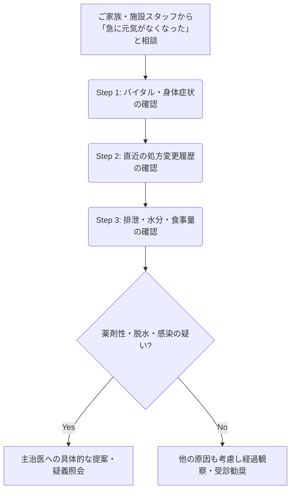

# 🧠 急に元気がなくなったら？薬剤師が確認したいこと

  <strong>【在宅医療での私のヒヤリハット体験】</strong> 
  ある日、在宅訪問をしている高齢の患者さんのご家族から「ここ2〜3日、急に元気がなくなって、日中もずっとウトウトしているんです。認知症が進んだのでしょうか……」と悲しそうに相談されました。  
  私は「急な認知機能の低下（せん妄など）や認知症の進行かな？」と思い、主治医への報告を考えました。しかし、ふとバイタルサインと処方履歴、そしてお部屋の様子を確認すると、ある「見落とし」に気づいたのです。  
  実は数日前に他科で処方された「アレルギーの薬（抗ヒスタミン薬）」が追加されており、さらに部屋の温度が高く「水分摂取」が全くできていませんでした。つまり、<strong>薬の副作用（眠気・認知機能低下）と軽度の「脱水」が重なった結果</strong>だったのです。  
  医師に相談して処方を整理し、水分補給を促したところ、数日で元の元気な姿に戻られました。「認知症のせい」と決めつけず、多角的にアセスメントすることの重要性を痛感した出来事でした。

高齢者や在宅医療の現場では、<strong>「高齢者 活気低下」</strong>の原因が単なる老化や病気の進行ではなく、<strong>「処方薬の影響（薬剤性）」や「環境の変化」</strong>であるケースが多々あります。

今回は、患者さんの「急な元気低下」に直面したとき、私たち薬剤師がどのような視点で<strong>服薬アセスメント</strong>を行うべきか、具体的かつ実践的に解説します！

---

## 🔍 1. 急な活気低下を引き起こす「5大原因」とチェックポイント

「急に元気がなくなった」という症状の裏には、大きく分けて5つの原因が潜んでいます。これらをおさえておくだけで、疑義照会や医師への報告の質が劇的に向上します。

  

    
① 薬剤性（うつ・認知機能低下）

    
新規開始薬、増量された薬のチェック

  

  

    
② 脱水・電解質異常

    
利尿薬、SGLT2阻害薬による影響

  

  

    
③ 便秘・尿閉（排泄トラブル）

    
抗コリン作用を持つ薬剤の見落とし

  

  

    
④ 低血糖（糖尿病患者）

    
SU薬、インスリン、食事量低下

  

### 💊 ① 薬剤性（薬剤性うつ・薬剤性認知症）
高齢者は薬物の代謝・排泄能が低下しているため、通常量でも過量投与になりがちです。特に以下の症状に注意します。
- <strong>薬剤性うつ</strong>: H2ブロッカーやβ遮断薬、インターフェロン製剤などで、抑うつや活動性の低下（意欲減退）が見られることがあります。
- <strong>薬剤性認知症（認知機能障害）</strong>: 抗コリン薬、ベンゾジアゼピン系睡眠薬・抗不安薬などにより、頭がぼーっとしたり、つじつまの合わない言動が増えたりします。

### 💧 ② 脱水・電解質異常（特に「脱水 薬」の関連性）
高齢者は口渇感を感じにくく、簡単に脱水に陥ります。特に<strong>利尿薬</strong>や<strong>SGLT2阻害薬</strong>を服用している患者さんでは、急激な脱水や低ナトリウム血症（倦怠感、ふらつき、活気低下の主因）が起こりやすくなります。

### 💩 ③ 便秘・尿閉による「身体的不快感」
言葉で「お腹が張って苦しい」「尿が出ない」と伝えられない患者さんは、<strong>身体的不快感から活動性が著しく低下し、一見すると「元気がない」状態</strong>に見えることがあります。抗コリン薬（過活動膀胱治療薬、第一世代抗ヒスタミン薬、三環系抗うつ薬など）が引き金になります。

### 🍭 ④ 低血糖
糖尿病薬（特にSU薬やインスリン）を導入している場合、食事量の低下に対して薬の量がそのままだと、持続的な低血糖により活気がなくなります。「高齢者の低血糖は冷や汗などの交感神経症状が出にくく、ただ元気がなくなる（傾眠傾向など）だけ」という特徴を覚えておきましょう。

### 🦠 ⑤ 感染症（尿路感染症・不顕性肺炎）
高齢者は感染症にかかっても熱が出ないことが多く、最初のサインが「なんとなく元気がない」「急に動けなくなった（<strong>急なADL低下</strong>）」という形で現れます。

---

## 📊 2. 【一目でわかる】活気低下を引き起こしやすい主な薬剤一覧

実務で処方監査を行う際、以下の薬剤が「最近追加・増量されていないか」を必ずプロファイルで確認しましょう。横スクロールで詳細を確認できます。

| 薬効分類 | 代表的な薬剤名 | 活気低下（元気消失）を起こすメカニズム | 薬剤師の確認ポイント |
| :--- | :--- | :--- | :--- |
| <strong>ベンゾジアゼピン系 （睡眠薬・抗不安薬）</strong> | デパス（エチゾラム） ハルシオン（トリアゾラム）など | 筋弛緩作用、ふらつき、過度の鎮静による傾眠・意欲低下。 | 翌朝まで持ち越していないか？ 転倒リスクの上昇はないか？ |
| <strong>抗コリン作用薬</strong> | ポララミン（d-マレイン酸クロルフェニラミン） ベシケア（ソリフェナシン）など | 脳内アセチルコリン低下による認知機能低下。 尿閉や便秘による不快感。 | 口渇、便秘、かすみ目がないか？ OTCの風邪薬や鼻炎薬を併用していないか？ |
| <strong>利尿薬</strong> | ラシックス（フロセミド） アルダクトンA（スピロノラクトン）など | 脱水および低ナトリウム血症、低カリウム血症などの電解質異常。 | 急激な体重減少はないか？ 皮膚の乾燥、血圧低下はないか？ |
| <strong>β遮断薬</strong> | メインテート（ビソプロロール）など | 脳内のβ受容体遮断による抑うつ傾向、徐脈による倦怠感。 | 徐脈（脈拍50回/分以下など）になっていないか？ 「やる気が出ない」などの訴えはないか？ |
| <strong>H2受容体拮抗薬</strong> | ガスター（ファモチジン）など | 血液脳関門（BBB）を通過しやすく、中枢作用によるせん妄、抑うつ、不穏。 | 腎機能（eGFR）に応じた減量ができているか？ |
| <strong>SGLT2阻害薬</strong> | ジャディアンス（エンパグリフロジン）など | 尿糖排泄に伴う浸透圧利尿による脱水。 | 十分な水分摂取ができているか？ 皮膚をつまんだ時の戻りが遅くないか？ |

---

## 🛠️ 3. 実践！薬剤師が明日から使えるアセスメントステップ

患者さんの「急な元気低下」の相談を受けたら、以下のフローで聞き取りと情報収集（<strong>服薬アセスメント</strong>）を行いましょう。

### 📋 Step 1: バイタル・身体症状の確認
まずは基本情報の整理です。
- <strong>熱はないか？</strong>（微熱であっても、高齢者にとっては高熱に相当する感染症の可能性があります）
- <strong>血圧・脈拍は？</strong>（血圧低下や徐脈は脱水やβ遮断薬の効きすぎを疑います）
- <strong>意識状態は？</strong>（常にウトウトしている場合は、低血糖やベンゾジアゼピンの蓄積、高アンモニア血症などを疑います）

### 📝 Step 2: 直近の処方変更履歴の確認
薬歴を過去1ヶ月〜数ヶ月まで遡ります。
- <strong>直近（2週間〜1ヶ月以内）で新規導入された薬、増量された薬はないか？</strong>
- 他院や皮膚科、耳鼻科、整形外科などから<strong>重複する抗コリン薬</strong>（貼り薬や点眼薬、OTC医薬品も含む）が出ていないか？

### 💧 Step 3: 排泄・水分・食事量の確認
日々の生活状況を確認します。
- <strong>水分は1日どれくらい飲めているか？</strong>（特に夏場や、冬場のこたつ使用時などは「脱水 薬」の副作用が顕著に出ます）
- <strong>便は何日出ていないか？尿はしっかり出ているか？</strong>
- <strong>食事量は落ちていないか？</strong>（糖尿病薬を飲んでいる場合は特に重要）

  <strong>🚨 ここに注意！「薬剤性認知症・うつ」を見逃さないために</strong> 
  高齢者が「急に認知症っぽくなった」「塞ぎ込むようになった」とき、周囲は『トシのせい』『認知症の始まり』と諦めてしまいがちです。しかし、薬剤師が<strong>「この薬が始まってから変化はありませんでしたか？」</strong>と問いかけることで、初めて薬の影響に気づけるケースが非常に多いのです。

---

## 🤝 4. 医師へ報告・提案（疑義照会）するときの文例

アセスメントの結果、薬の影響が疑われる場合は、ただ「元気がないそうです」と伝えるのではなく、<strong>具体的な根拠と代替案</strong>を持って主治医に報告しましょう。

  <strong>💬 医師への報告・提案テンプレート</strong>  
  「〇〇様の件でご相談です。ここ数日『急に活気がなくなりウトウトしている』とご家族から相談がありました。 
  バイタルはBP 98/54、HR 52とやや低下傾向で、10日前に開始された<strong>メインテート2.5mg</strong>による徐脈・倦怠感の可能性、あるいは同時に処方された<strong>ベシケア</strong>による口渇・水分摂取低下に起因する脱水の可能性が考えられます。  
  一度、メインテートを1.25mgに減量、もしくは一時中止とし、経過を観察することはいかがでしょうか？」

このように、<strong>「いつから」「どんな症状があり」「どの薬剤のどの作用が疑われ」「どう対応すべきか」</strong>をロジカルに伝えることで、医師からの信頼度も一気に高まります。

---

## 🌿 5. まとめ：薬を見るだけでなく「生活と身体」を見よう

「急に元気がなくなった」というイベントは、在宅医療や日々の薬局店頭でよく遭遇する重要なサインです。

私たち薬剤師が、処方箋の文字情報だけを追うのではなく、患者さんの<strong>「高齢者 活気低下」</strong>の裏にある生活環境（水分摂取、排泄など）や、潜在的な副作用に目を向けることで、防げる重症化や改善できるADL（日常生活動作）がたくさんあります。

冒頭の私のエピソードでも、アレルギー薬の中止とOS-1（経口補水液）による水分補給の提案を行い、患者さんは1週間後にはいつものように笑顔で冗談を言ってくれるようになりました。

「あれ？いつもと様子が違うな」と感じたら、ぜひ今回のチェックポイントと薬剤リストを思い出し、<strong>一歩踏み込んだ服薬アセスメント</strong>を実践してみてくださいね！